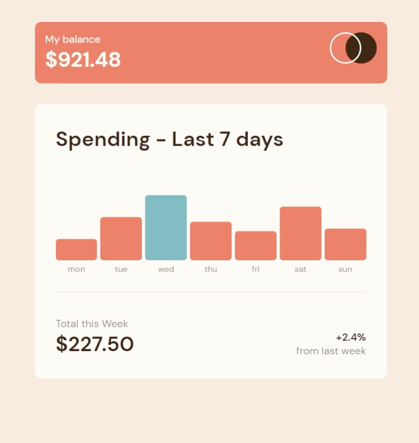

<h1>Expenses Chart</h1>

En este proyecto hago un componente de un Web App más amplia. Este componente recibe un archivo de datos que contiene los gastos de la semana y los muestra al usuario en forma de un gráfico. 

<h1>Preview del proyecto<h1>

<h1>Funciones principales</h1>
  <ul>
    <li>Mostrar al los datos según el archivo de datos</li>
    <li>Cuando hacemos Hover a las barras, mostrar el gasto y cambiar el color de las mismas</li>
    <li>Si se modifica el archivo de datos de forma manual, las barras se deben ajustar por si solas.</li>
   
  </ul>
  
  <h1>Recursos utilizados</h1>
  <ul>
      <li>
<a href="https://www.w3schools.com/js/js_api_intro.asp">Web APIs - Introduction</a>
</li>
    
A pesar de ser un archivo local, se simuló que los datos tienen de origen un API

      <li>
<a href="https://www.w3schools.com/jsref/jsref_filter.asp">JavaScript Array filter()
</a>
</li>
    
Documentación del metodo Filter()

      <li>
<a href="https://www.w3schools.com/jsref/jsref_map.asp">JavaScript Array map()</a>
</li>
    
Documentación del método Map()

      <li>
<a href="JavaScript Sorting Arrays">JavaScript Sorting Arrays</a>
</li>
    
Documentación del método Sort()

      <li>
<a href="https://www.w3schools.com/jsref/jsref_reduce.asp">JavaScript Array reduce()</a>
</li>
    
Documentación del método Reduce()

    <li>
<a href="https://www.frontendmentor.io/home">Frontend Mentor</a>
</li>
    
Página Web donde podrás conseguir retos de Frontend. Muy recomendado!

  </ul>
  <h1>Código</h1>
  
Con toda libertad puedes bajar o clonar este repositorio!

  
Si tienes algún comentario o tienes una mejor forma de desarrollar el código, no dudes en comentarlo! Sharing Is Caring!

